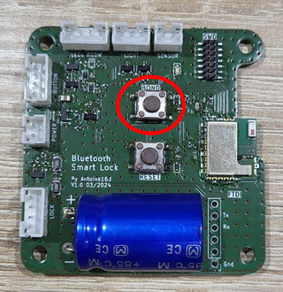
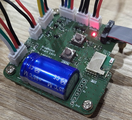

# Bluetooth LE Smart Lock

Ce dépôt contient le code source et les instructions nécessaires pour construire et utiliser une serrure électronique intelligente basée sur Bluetooth Low Energy (BLE). Cette serrure peut être déverrouillée via une application Android. Le projet est divisé en plusieurs parties, couvrant différents aspects de la serrure, de la carte électronique au firmware en passant par l'application mobile.


## Fonctionnalités

### Générales

- **Déverrouillage à distance** : Permet de déverrouiller la serrure via une connexion BLE.
- **Ouverture manuelle** : Offre la possibilité d'ouvrir la serrure en appuyant sur un bouton poussoir.
- **Verrouillage automatique** : Verrouille automatiquement la serrure lorsque la connexion BLE est perdue, assurant ainsi la sécurité.
- **Éclairage d'ambiance** : Utilise un ruban LED RGBW pour afficher l'état de la serrure, offrant une indication visuelle.
- **Éclairage extérieur** : Active l'éclairage extérieur lorsque la serrure est ouverte la nuit, améliorant la visibilité.

### Firmware de la serrure
- **Connexion radio via Bluetooth LE** : Permet la communication sans fil avec les appareils compatibles doter de l'application Android.
- **Contrôle de l'ouverture de la serrure** : Gère le mécanisme de déverrouillage de la serrure.
- **Bouton poussoir lumineux** : Permet l'ouverture manuelle de la serrure et affiche visuellement la possibilité d'ouverture.
- **Détection de la luminosité extérieur** : Mesure la luminosité environnante pour détectée la nuit.
- **Pilotage de Ruban LED RGBW 12V** : Utilise un ruban LED pour afficher l'état de la serrure de manière visuelle.
- **Pilotage d'un Éclairage 12V** : Contrôle l'éclairage extérieur pour améliorer la visibilité la nuit. Basé sur le projet [Mini-Light](https://github.com/antoine163/Mini-Light/tree/master/Elec/light), mais d'autres types d’éclairage peuvent être adaptés.

### Application Android (Ble Smart Key)
- **Scan et appairage** : Permet de détecter et d'appairer la serrure BLE avec l'appareil Android.
- **Renommage de la Serrure BLE** : Permet de personnaliser le nom de la serrure pour une identification facile.
- **Déverrouillage et réglage de la Proximité BLE** : Permet de déverrouiller la serrure et d'ajuster la distance de déverrouillage.
- **Ouverture par Bouton** : Permet l'ouverture de la serrure via un bouton sur l'application.
- **Notification d'Éloignement** : Avertit l'utilisateur si la serrure n'est pas verrouillée lorsqu'il s'éloigne.

## Composants du projet
Ce projet est divisé en plusieurs parties organisées dans plusieurs dépôts git.

 - **Carte principale - [BleSmartLock](hardware/BleSmartLock/README.md)**: Basée sur le module [bluenrg-m2](https://www.st.com/en/wireless-connectivity/bluenrg-m2.html), cette carte gère les communications BLE, le contrôle de la serrure et les interactions avec les autres composants.
 - **Carte optionnelle - [LightSensor](hardware/LightSensor/README.md)**: Cette carte optionnelle mesure la luminosité ambiante et transmet ces informations à la carte principale pour activer l'éclairage extérieur la nuit.
 - **Carte optionnelle - [Mini-Light](https://github.com/antoine163/Mini-Light/tree/master/Elec/light#readme)**: Cette carte optionnelle correspond à la carte pour l'éclairage extérieur. Elle est composer de LEDs blanche de puissance. *Note*: cette carte est récupérer d'un autre project.
- **[Firmware](firmware/README.md) de la carte *BleSmartLock***: Développé pour le module [bluenrg-m2](https://www.st.com/en/wireless-connectivity/bluenrg-m2.html), il gère notamment la connexion BLE et le déverrouillage de la serrure.
- **Application Android - [Ble Smart Key](firmware/README.md)**: Cette application permet le déverrouillage de la serrure via BLE, la configuration, le scan et l'appairage, le renommage de la serrure.

### Les dépôts:
 - [ble-smart-lock-hardware](https://github.com/antoine163/ble-smart-lock-hardware): Contient les cartes électroniques *BleSmartLock* et *LightSensor*. 
 - [ble-smart-lock-firmware](https://github.com/antoine163/ble-smart-lock-firmware): Contient le firmware de la cartes électroniques *BleSmartLock*. 
 - [ble-smart-lock-android-app](https://github.com/antoine163/ble-smart-lock-android-app): Contient l'application Android nommée *Ble Smart Key*.
 - [Mini-Light](https://github.com/antoine163/Mini-Light): Contient la carte électronique *Mini-Light*.


### Cloner tous les dépôts

```sh
git clone --recurse-submodules git@github.com:antoine163/ble-smart-lock.git
git clone git@github.com:antoine163/Mini-Light.git
```
# Manuel d'utilisation

### États de la serrure

| BLE           | Porte   | Éclairage ambiance  | Éclairage extérieur   | Voyant Bouton |
| ------------- | :-----: | :------:            | :------:              | :----:        |
| Appairage     |         | Vert sinusoïdale    | Éteint                | Éteint        |
| Erreur radio  |         | Rouge fixe          | Éteint                | Éteint        |
||
| Non connecté  | Fermé   | Éteint              | Éteint                | Éteint        |
| Connecté      | Fermé   | Bleu sinusoïdale    | Éteint                | **Allumé** sinusoïdale|
| Déverrouillé  | Fermé   | Bleu fixe           | Éteint                | **Allumé** fixe| 
||                              
| Non connecté (suit déconnexion)               | Ouvert  | Rouge clignotant                    | Éteint                                | Éteint        |
| Non connecté (suit ouverture par clef)        | Ouvert  | **Blanc** (Nuit) \| Jaune (jour)    | **Allumé** (Nuit) \| Éteint (jour)    | Éteint        |
| Connecté                                      | Ouvert  | **Blanc** (Nuit) \| Jaune (jour)    | **Allumé** (Nuit) \| Éteint (jour)    | Éteint        |
| Déverrouillé                                  | Ouvert  | **Blanc** (Nuit) \| Jaune (jour)    | **Allumé** (Nuit) \| Éteint (jour)    | Éteint        |


## Appairage
Pour passer la serrure en mode appairage, appuyez brièvement sur le bouton bond.  


La lumière d'ambiance devient verte clignotante sinusoïdale et la serrure devient visible par les appareils BLE à proximité.
Le PIN par défaut est 215426. Il peut être changé via la liaison série avec la commande `pin new_pin`, où *new_pin* doit être compris entre 0 et 999999.

### Fermeture du mode appairage
Le mode appairage peut être désactivé de plusieurs façons :
 - En appuyant brièvement sur le bouton *bond*.
 - Automatiquement après un délai de 10 secondes.
 - Automatiquement après une tentative d'appairage réussie ou échouée.

### Effacement de la liste des appareils appairés
Pour effacer la liste des appareils appairés, maintenez le bouton *bond* enfoncé pendant plus de 3 secondes. Deux flashs blancs seront émis une fois la liste effacée. Il est possible de supprimer cette liste avec la commande `bond-clear` via la liaison série.

## Liste des commandes série
- `help`: Afficher l'aide.
- `verbose` : Lecture/écriture du mode verbeux. 1 pour activer, 0 (par défaut) pour désactiver.
- `pin` : Lecture/écriture du code PIN (215426 par défaut).
- `bri` : Lecture de la luminosité ambiante.
- `bri-th` : Lecture/écriture du seuil jour/nuit (50% par défaut).
- `bond` : Afficher la liste des appareils appairés.
- `bond-clear` : Supprimer tous les appareils appairés (ou maintenir le bouton *bond* enfoncé pendant plus de 3 secondes).
- `reset` : Réinitialiser toutes les valeurs par défaut.

## LED rouge
La LED rouge située sur le PCB s'allume/clignote en fonction de l'activité radio.  

